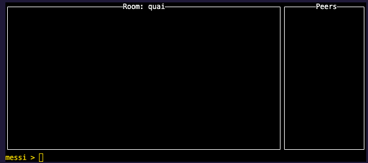
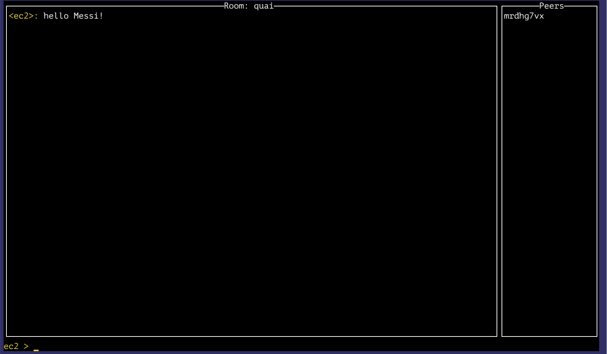
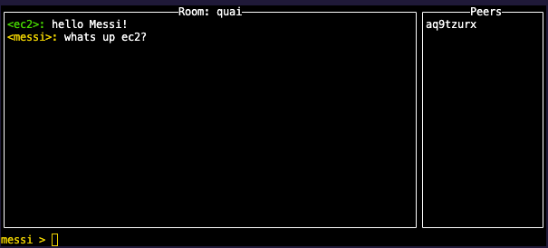

# This is a WIP

## available commands

```bash
go-quai start

go-quai help
```
## available flags

For complete options see the 'help' dialogue:

```bash
go-quai --help
  ```

## starting the node

```bash
go run main.go start -l debug -p 4002 -t 8081 -k ../priv.key
```
## http endpoints

### /discover/{peerId}
Discovers and connects to a peer

```bash
❯ curl http://127.0.0.1:8080/discover/12D3KooWAwgaeQwgWSdqj9m76wALTz9rpKDGBP6grxQ7hzA2ZVCk
Discovered and connected successfully to peer 12D3KooWAwgaeQwgWSdqj9m76wALTz9rpKDGBP6grxQ7hzA2ZVCk
```

### /send/{peerId}
Sends a message to a peer

```bash
curl -X POST http://127.0.0.1:8080/send/12D3KooWAwgaeQwgWSdqj9m76wALTz9rpKDGBP6grxQ7hzA2ZVCk -d "Hello from peer #1"
Message sent successfully
```

### /nodepeers
Lists all the peers connected to the node

```bash
curl -X POST http://127.0.0.1:8080/nodepeers
12D3KooWSU15KT6Q3uzsVG2Jixa9tprzGzdtMN7d7zKVBvVstTw3
12D3KooWJn4G4MR8oWy99ss4wZM5BJuhkto1Rt4QD34QopVECZDE
...
12D3KooWAsst1B28BmudgEJy6yNmQqXxrLKdfWrMVAJNnZcrmSCL
```

## Gossip chat app (used for testing purposes)

1. To start the app and join the chat room:

  ```bash
  go run main.go chat --nickname=messi --chatroom=quai
  ```

  You should see a UI like this:

  

2. Then from another machine join the same chatroom boostrapping the node (`-b` flag) with an "advertised listening address" of the first node.
   - Note: listening addresses can be found in the file `node.info` in the root of the project.

  ```bash
  go run main.go chat --nickname=ec2 --chatroom=quai -b '/ip4/181.95.42.32/tcp/4001/p2p/12D3KooWAsSneYwJ2RV93FpYZUpdXmZLz6FJZNUNddMcmrdhg7vx'
  ```

  Another UI will open where you can chat with the first node:
  

3. And then the first node can send a reply:

  

